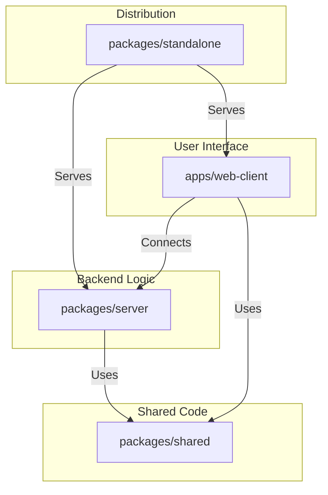

# Architecture

This document outlines the technical architecture of Terminal Code (`tcode`), a lightweight, progressive web app (PWA) designed to provide a clean, mobile-friendly terminal interface for remote development environments, with an initial focus on GitHub Codespaces with the intent to support any code-server back-end by providing a consumer for dev-tunnels targeting any device.

## Core Principles

The architecture is guided by the following principles:

1.  **Decoupling:** The frontend client is a pure presentation layer, completely decoupled from the backend. This allows the client to evolve independently and potentially connect to different types of backends in the future.
2.  **Simplicity:** The technology stack was chosen to minimize complexity and improve the developer experience. The frontend uses Preact and standard web technologies, avoiding complex build steps or non-standard syntax.
3.  **Security:** The connection to development backends is secured using session-based, in-memory ephemeral SSH keys, ensuring that no sensitive credentials are ever stored on disk or beyond the scope of the session - new session, new key puts the burden on the codespace authentication/authorisation method (tokens and in future oauth).
4.  **Extensibility:** The system is designed in a modular way to support future integrations, such as new backend connectors (e.g., local Docker containers) and advanced AI-powered tooling.

---

## System Components

The `tcode` ecosystem is a monorepo comprised of four main packages:



1.  **`apps/web-client` (Frontend PWA):**
    *   A **Preact**-based single-page application that serves as the user interface.
    *   Renders the terminal using **xterm.js** and UI components styled with **Tailwind CSS (DaisyUI)**.
    *   Communicates with the backend `server` via a single WebSocket connection.
    *   It is a pure presentation layer with no direct knowledge of the backend business logic.

2.  **`packages/server` (Backend Core):**
    *   A Node.js library responsible for all backend logic.
    *   Manages connections to GitHub Codespaces using the Microsoft Dev Tunnels SDK.
    *   Handles the entire connection lifecycle, including authentication, codespace discovery, and terminal session management.
    *   Implements the ephemeral SSH key generation for secure connections.
    *   Exposes its functionality through a `CodespaceWebSocketHandler`.

3.  **`packages/shared` (Shared Utilities):**
    *   A collection of shared TypeScript types, interfaces, and constants used across both the frontend and backend.
    *   Ensures type safety and consistency throughout the monorepo.

4.  **`packages/standalone` (Distribution Wrapper):**
    *   A lightweight Node.js/Express server that bundles the frontend and backend into a single, easy-to-run application.
    *   Serves the static assets of the `web-client`.
    *   Hosts the WebSocket server and uses the `CodespaceWebSocketHandler` from `packages/server` to handle incoming connections.
    *   **Environment Token Support:** For single-user deployments, if a `GITHUB_TOKEN` environment variable is set, the standalone server automatically uses it as a fallback when clients don't provide a token during authentication. This feature is designed for personal/development environments where manual token entry isn't convenient.
    *   This is the main entry point for the `npx tcode` command.

---

## Connection & Data Flow

The connection process is designed to be secure and efficient, minimizing latency by establishing a direct tunnel to the development environment.

1.  **Startup:** The user runs `npx tcode`, which starts the `packages/standalone` server. This server serves the `web-client` PWA and opens a WebSocket endpoint.
2.  **Client Connection:** The `web-client` connects to the standalone server's WebSocket.
3.  **Authentication:** The user provides a GitHub token (or the server uses the `GITHUB_TOKEN` environment variable as a fallback in single-user deployments). The client sends this to the server, which uses it to authenticate with the GitHub API.
4.  **Codespace Discovery:** The server fetches the user's list of available GitHub Codespaces and sends it back to the client.
5.  **Tunnel Establishment:** The user selects a codespace. The `server` package then:
    a.  Establishes a **Microsoft Dev Tunnel** to the chosen codespace.
    b.  Uses gRPC to communicate with the codespace's internal services.
    c.  Generates an **ephemeral SSH key pair** in memory.
    d.  Starts an SSH server within the codespace, configured with the public key.
    e.  Connects to this SSH server through the tunnel using the in-memory private key.
6.  **Terminal Session:** Once the SSH connection is established, all terminal I/O is piped through the WebSocket, providing a real-time, interactive session.
7.  **Real-time Updates:** The server continuously monitors the codespace for changes (e.g., forwarded ports, git status) and pushes updates to the client.

---

## Frontend Architecture

The frontend is a modern Preact application built with Vite.

*   **Framework:** **Preact** is used for its small footprint and performance. All UI elements, including the status bar, modals, and dialogs, are implemented as Preact components.
*   **State Management:** Component state is managed locally using Preact's built-in hooks (`useState`, `useEffect`, `useCallback`). A single WebSocket connection, managed in the root `App` component, serves as the primary channel for server-driven state changes.
*   **Terminal Emulation:** **xterm.js** is used to provide a full-featured, themeable terminal interface. The `@xterm/addon-fit` addon is used to ensure the terminal resizes correctly with the browser window.
*   **Styling:** **Tailwind CSS** with the **DaisyUI** component library provides a clean, VS Code-inspired look and feel with minimal custom CSS.
*   **WebSocket Connection:** The client automatically detects the WebSocket server URL based on the current page location (ws:// for http:// and wss:// for https://). This can be overridden using the `VITE_TCODE_BACKEND` environment variable for custom deployments:
    ```bash
    # Override backend URL at build time
    VITE_TCODE_BACKEND=ws://custom-server.com:3000 npm run build
    
    # Override backend URL for development
    VITE_TCODE_BACKEND=ws://localhost:3000 npm run dev
    ```

---

## Backend Architecture

The backend is designed to be a modular and secure Node.js application.

*   **Core Logic (`packages/server`):** This package contains all the complex logic for interacting with GitHub and Dev Tunnels. It is designed to be a reusable library.
*   **WebSocket Handler (`CodespaceWebSocketHandler`):** This class is the primary interface to the backend logic. It encapsulates the entire communication flow and state management for a single client connection.
*   **Security (Ephemeral SSH Keys):** To avoid storing or managing user SSH keys, the server generates a new, in-memory Ed25519 key pair for every connection attempt. This key pair is used for a single session and is destroyed when the connection is closed. This "zero trust" approach significantly enhances security.
*   **Dev Tunnels Integration:** The backend uses the `@microsoft/dev-tunnels-*` SDK to manage the connection to the codespace. It uses the tunnel's gRPC capabilities to start the remote SSH server and the port forwarding features to establish the terminal connection.

### Architectural Improvement Opportunities

*   **Decouple WebSocket Handler:** The `CodespaceWebSocketHandler` could be further refactored into smaller, more focused services (e.g., `AuthService`, `CodespaceService`, `TerminalSessionManager`). This would improve separation of concerns, making the codebase easier to test and maintain.
*   **Pluggable Connectors:** The logic for connecting to GitHub Codespaces could be abstracted into a generic `Connector` interface. This would make it easier to add support for other backends (e.g., local Docker containers, other cloud IDEs) in the future.

---

## Communication Protocol (WebSocket)

Communication between the client and server happens via JSON-based messages over a single WebSocket connection.

### Communication Protocol (WebSocket)

Communication between the client and server happens via JSON-based messages over a single WebSocket connection. The full message schema is defined and documented with TSDoc in `packages/shared/src/types/websocket.ts`.

Below is a summary of the message types.

#### Client to Server Messages

These messages are sent from the `web-client` to the `server` server.

| Message Type | Payload | Description |
| :--- | :--- | :--- |
| `authenticate` | `{ token: string }` | Authenticates the session using a GitHub token. |
| `list_codespaces` | (none) | Requests the list of available codespaces for the user. |
| `connect_codespace` | `{ codespace_name: string }` | Initiates a connection to the specified codespace. |
| `disconnect_codespace`| (none) | Gracefully disconnects from the current codespace. |
| `input` | `{ data: string }` | Sends user keystrokes or commands to the remote terminal. |
| `resize` | `{ cols: number, rows: number }` | Informs the server that the terminal UI has been resized. |
| `refresh_ports` | (none) | Manually requests an update of forwarded port information. |
| `start_codespace` | `{ codespace_name: string }` | Requests that a stopped codespace be started. |
| `stop_codespace` | `{ codespace_name: string }` | Requests that a running codespace be stopped. |

#### Server to Client Messages

These messages are sent from the `server` server to the `web-client`.

| Message Type | Payload | Description |
| :--- | :--- | :--- |
| `authenticated` | `{ success: boolean }` | Confirms the result of the authentication attempt. |
| `codespaces_list` | `{ data: Codespace[] }` | Provides the client with the list of available codespaces. |
| `codespace_state` | `{ state: string, ... }` | Updates the client on the connection status of a codespace. |
| `output` | `{ data: string }` | Streams output from the remote terminal to the client. |
| `port_update` | `{ ports: ForwardedPort[], ... }` | Notifies the client of changes to forwarded ports. |
| `disconnected_from_codespace` | (none) | Confirms that the session has been disconnected. |
| `error` | `{ message: string }` | Informs the client of a non-fatal error. |

---

## Future Vision

*   **Model Context Protocol (MCP):** A primary goal is to integrate AI-powered code assistance. This will involve implementing a protocol to intelligently gather context from the user's environment (e.g., git status, open files, terminal history) and yield tighter integration with the underlying code-server.
*   **Multi-Backend Support:** By refactoring to a pluggable connector model, `tcode` could connect to a variety of development environments beyond GitHub Codespaces.